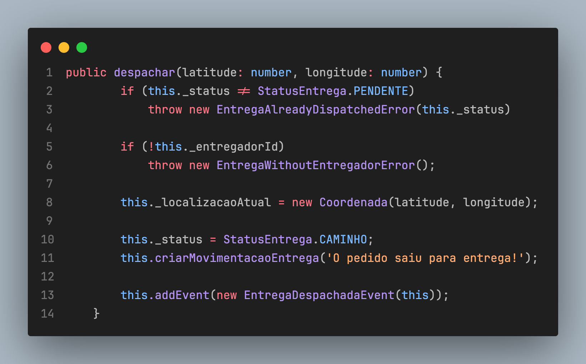
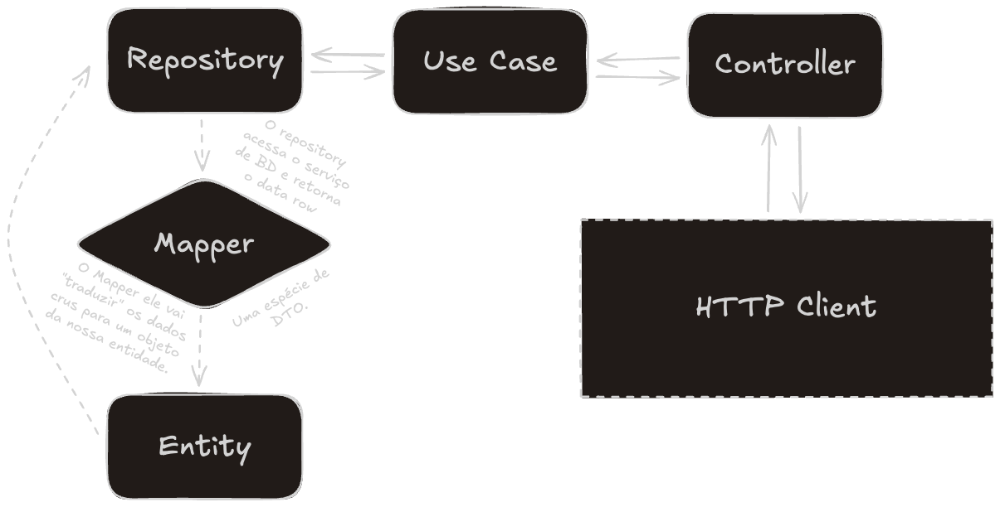
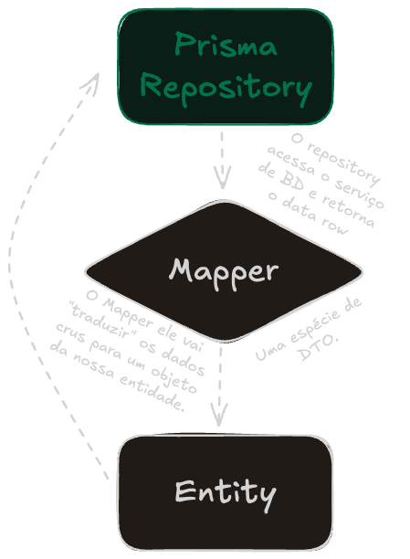
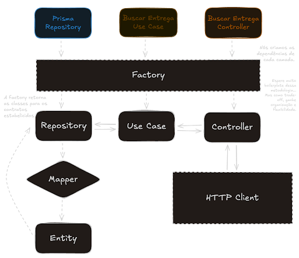
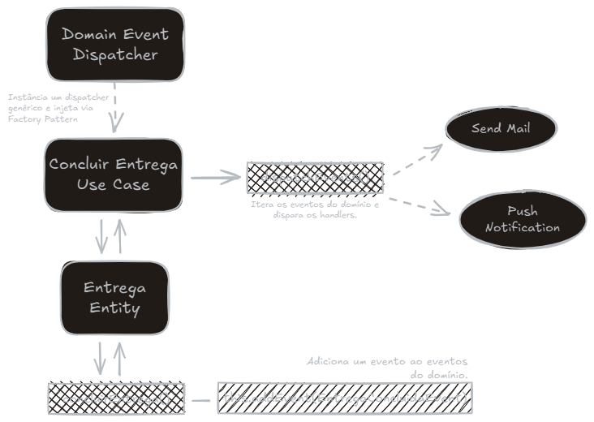
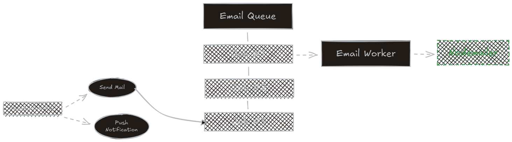

## Clean Architecture
A Clean Architecture (Arquitetura Limpa) foi proposta por Robert C. Martin e consiste em organizar o código por camadas, onde cada uma possui sua própria responsabilidade bem definida.

Para que essa abordagem funcione, precisamos seguir sua regra fundamental: a Regra de Dependência. Ela dita que as dependências de código só podem apontar para dentro. Ou seja, as camadas internas, como a camada de domínio (regras de negócio), não conhecem e não dependem das camadas externas, como a infraestrutura.

Isso resulta em um sistema fracamente acoplado e altamente coeso. Por isso, conceitos como SRP (Princípio de Responsabilidade Única) e DI (Injeção de Dependência) são vitais para essa arquitetura.
###

## Camadas
### 1. Infrastructure (Infraestrutura)
De forma simplificada, esta é a camada do "mundo real". É onde os detalhes técnicos residem: nosso framework web (Express), banco de dados (Prisma/Postgres), serviço de cache (Redis), filas e implementações de envio de e-mail. Ela muda com frequência, mas não deve afetar o coração do sistema.

### 2. Application (Aplicação)
A camada de aplicação é onde ocorrem as operações e a orquestração das regras de negócio. Aqui encontramos a implementação dos nossos Casos de Uso (Use Cases). Ela atua como uma "cola", buscando dados nos repositórios e acionando as entidades, mas sem conhecer detalhes de frameworks (como rotas HTTP ou SQL puro).

### 3. Domain (Domínio)
Aqui estão as regras de negócio corporativas ("Enterprise Business Rules"). Nossas Entidades e regras vitais estão definidas aqui. É crucial que essa camada não conheça o banco de dados ou qualquer estrutura de infraestrutura. Tudo aqui funciona por meio de contratos (Interfaces) e Lógica Pura, garantindo que o núcleo do software seja agnóstico a tecnologias externas.

### 4. Core/Shared Kernel (Núcleo)
Classes abstratas, tipos genéricas e interfaces que são compartilhadas em todas as outras camadas.

## DDD (Domain-Driven Design)
O DDD é uma abordagem de desenvolvimento que tem como idéia centralizar a camada de domínio no desenvolvimento de software. Elaborada por Eric Evans, ganhou popularidade porque o conceito de **linguagem úbiqua** permite conectar o desenvolvedor com o time de negócio. 

Trazer as regras de negócio para perto do código traz clareza e benefícia a escalabilidade do softaware. Porque usamos uma linguagem universal e as regras de negócio agrupadas em contextos delimitados, chamados de **Bounded Contexts**, esses contextos são delimitadores para cada área da regra de negócio.

Em um exemplo rápido, no DDD, não podemos simplesmente trocar um status da maneira tradicional `this.status = 'CAMINHO';`, o código precisa deixar explícito qual requisito da regra de negócio está sendo resolvido... Isso torna sua entidade rica, não uma entidade anêmica. Quando estamos trocando o status de uma entrega para `CAMINHO` estamos basicamente fazendo um despacho da entrega na regra de negócio. Por isso, deixamos claro: `entrega.despachar();`.
###

## Fluxo de dados da API
Eu apliquei um DDD estratégico com Clean Architecture para estruturar meu software. Quero usar esse tópico para explicar parte do fluxo de dados com alguns diagramas simples.

### Antes de mais nada... E o Over-engineering?
Está fortemente presente nesse repositório.

Esse repositório foi feito para que eu estudasse aspectos de arquitetura e engenharia de software. Então sim, eu sei que não preciso usar muitos patterns ou conceitos nessa API, mas se eu não usar aqui, nunca vou usar na "vida real"... Talvez essa API não escale ao ponto dos trade-offs valerem a pena, mas está tudo bem. :)

## Padrão HTTP
O fluxo de entrada da API segue o princípio da dependência unidirecional. O Cliente HTTP acessa uma rota que é interceptada pela Camada de Interface (Controller). Esta, por sua vez, aciona a Camada de Aplicação (Use Case), que orquestra a Camada de Domínio.

Para garantir o desacoplamento, utilizamos rigorosamente o DIP (Dependency Inversion Principle). O Controller depende apenas de abstrações (interfaces) dos Use Cases, e os Use Cases dependem de abstrações dos Repositórios. Isso protege as regras de negócio de mudanças externas e facilita os testes.
###

### Data Mapper
Na infraestrutura, utilizo o Prisma ORM, que gera tipos inteligentes baseados no schema do banco de dados (Persistence Models). Embora isso agilize o desenvolvimento, permitir que esses objetos de banco vazem para a aplicação feriria o isolamento do Domínio.

Para resolver isso, apliquei o pattern Data Mapper. Ele atua como uma fronteira de tradução:

- Repository -> Mapper -> Entity: O Mapper recebe os dados crus do Prisma e reconstitui a Entidade de Domínio rica (com métodos e regras).

- Entity -> Mapper -> Repository: O Mapper desmonta a Entidade para o formato que o banco espera salvar.

Dessa forma, a camada de domínio permanece pura e agnóstica à tecnologia de banco de dados.
###

## Composition Root
Esse padrão de arquitetura consiste em criar todas as dependências do grafo em um único lugar, isso é uma boa prática arquitetural, porque incentiva a DI (Dependency Injection) tornando o software fracamente acoplado.

### Factory Pattern
Como o Creational Design Pattern, usei a metodologia de fábrica, as funções factory instanciam as classes concretas que são chamadas de produto. Os produtos são injetados em cada camada como dependência, uma vez que essas classes já esperavam essas dependências porque foram construídas com os contratos abstratos.

Essa metodologia gera um arquivo factory com muito boilerplate, até porque há apenas instâncias de várias classes nessa camada. Mas o trade-off é a centralização do código de criação, respeitando o SRP (Single Responsability Principle) pois a criação do objeto é separada do uso do objeto e o OCP (Open/Closed Principle) porque, futuramente, ao trocarmos a classe concreta basta alterarmos a instância e pronto, o código permanece funcional.
###

## Domain Events
O conceito de Domain Events surge da necessidade de desacoplar a regra de negócio principal de seus "efeitos colaterais" (side-effects). Frequentemente, uma ação no núcleo do sistema (como concluir uma entrega) precisa desencadear reações externas (enviar e-mail, notificar via push, gerar logs), mas a Entidade não deve conhecer essas implementações de infraestrutura.

Vamos usar a conclusão de entrega para exemplificar. A Entidade Entrega ao concluir a entrega vai adicionar um novo evento ao array de eventos do domínio (propriedade da classe): `EntregaConcluidaEvent`. Ela é agnóstica a quem vai ouvir esse evento.

O Use Case vai receber um objeto dispatcher e ao final da operação, o dispatcher percorrerá o array de eventos e chamará o handler de cada evento. Cada handler executará uma ação, como no diagrama, envio de email e push notification.

Isso respeita, mais uma vez, os princípios OCP porque nos permite adicionar novos recursos apenas adicionando um novo handler e o SRP porque cada camada conhece o contrato abstrato mas não o como é usado.
###

## Background Jobs & Queues
Em operações que dependem de serviços externos (como enviar e-mail via SMTP ou processar pagamentos), não podemos bloquear o thread principal da API enquanto aguardamos uma resposta. Isso causaria lentidão para o usuário final.

Para resolver isso, utilizamos o padrão de Filas (Queues) com separação entre Produtor e Consumidor:

- Handler: O evento SendMail apenas empacota os dados necessários (ex: destinatário, corpo) em um "Job" e o deposita na Email Queue. Essa operação é instantânea.
  
- Storage: A fila armazena os jobs, garantindo a persistência caso o serviço caia. Estou usando Redis para isso.
  
- Worker: Um processo dedicado (Email Worker), que roda independentemente da API, monitora a fila. Assim que um Job fica disponível, o Worker o captura e executa a integração pesada com o Nodemailer.

A API responde em milissegundos para o usuário "Entrega concluída com sucesso!", enquanto o processamento real acontece em segundo plano de forma resiliente (com suporte a retries automáticos em caso de falha).
###

